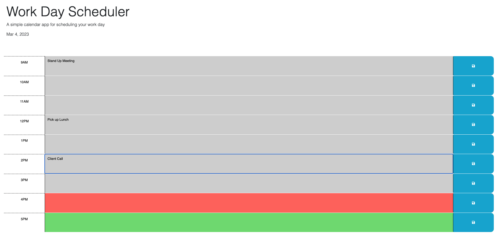

# 05 Third-Party APIs: Work Day Scheduler

## Description

The purpose of this project is to create a tool for managing time effectively. It allows a user to add and save events to each hour in the workday. The tool also shows today's date, and events in the past (grey), present (red), and future (green).

## Link to Deployed Application

https://pan-ev.github.io/work-day-scheduler/

## Screenshot of Deployed Application

